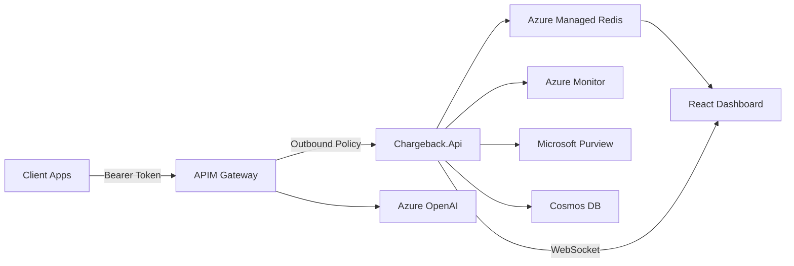

# Azure API Management OpenAI Chargeback Environment

[](https://opensource.org/licenses/MIT)
[](https://azure.microsoft.com)
[](https://openai.com)
[](https://docs.microsoft.com/azure/azure-resource-manager/bicep/)
[](https://www.terraform.io)
[](https://dotnet.microsoft.com)
[](https://learn.microsoft.com/dotnet/aspire/)
[](https://react.dev)

## TL;DR

Enterprise-ready solution for Azure OpenAI usage tracking and chargeback through Azure API Management. A single ASP.NET Minimal API handles log ingestion, cost calculation, billing plan management, and real-time dashboard streaming — orchestrated by .NET Aspire and secured with Entra ID JWT bearer tokens.

**🚀 Quick Deploy**: `git clone → ./scripts/setup-azure.ps1 → done`

**💰 What you get**: Real-time usage tracking, per-customer billing plans with quotas and rate limits (where a "customer" is any client app + tenant combination), overbilling support, per-deployment quotas, deployment access control (allowlist per plan/client), WebSocket live dashboard, durable Cosmos DB audit trail, monthly billing exports, DLP policy validation via Purview

**🏗️ Tech Stack**: .NET 10, Azure Container Apps, ASP.NET Minimal APIs, .NET Aspire, React/TypeScript, Azure Managed Redis, Cosmos DB, Bicep/Terraform, OpenTelemetry + Azure Monitor, Microsoft Purview (Agent 365)

## Quick Start

### Local Development

```bash
# Clone and run (requires .NET 10 SDK + Docker for Redis)
git clone https://github.com/your-org/apim-openai-chargeback-environment.git
cd apim-openai-chargeback-environment/src
dotnet run --project Chargeback.AppHost
```

The Aspire dashboard opens automatically at `https://localhost:17224` and provides resource status, logs, traces, and metrics for all services.

### Azure Deployment

**Option A: Bicep (all-in-one script)**

```powershell
# Deploys infrastructure, builds container, configures everything
./scripts/setup-azure.ps1 -Location eastus2

# With multi-tenant demo
./scripts/setup-azure.ps1 -Location eastus2 -SecondaryTenantId "<other-tenant-guid>"
```

**Option B: Terraform (two-stage)**

```powershell
# Stage 1: Deploy infrastructure (uses placeholder container image)
cd infra/terraform
cp terraform.tfvars.sample terraform.tfvars  # Edit with your values
terraform init
terraform apply

# Stage 2: Build and deploy the container to the provisioned ACR
cd ../..
./scripts/deploy-container.ps1 -ResourceGroupName rg-chrgbk-eastus2

# For multi-tenant: provision SPs in secondary tenant
cd infra/terraform
./register-secondary-tenant.ps1 -SecondaryTenantId "<tenant-id>" `
    -ApiAppId "<api-app-id>" -Client2AppId "<client2-app-id>"
```

The two-stage approach is required because the container image depends on the ACR (created by Terraform), and enterprise environments typically block public container registries. The `deploy-container.ps1` script builds the Docker image, pushes to the deployed ACR, and updates the Container App.

See the [Deployment Guide](docs/DOTNET_DEPLOYMENT_GUIDE.md) for full manual steps.

### Demo Client

```bash
# If you deployed with scripts/setup-azure.ps1, use the generated env file.
# DemoClient automatically loads .env.local/.env when present:
# demo/.env.local

# Or configure DemoClient via user secrets
dotnet user-secrets --project demo init
dotnet user-secrets --project demo set "DemoClient:TenantId" "<tenant-id>"
dotnet user-secrets --project demo set "DemoClient:ApiScope" "api://<gateway-app-id>/.default"
dotnet user-secrets --project demo set "DemoClient:ApimBase" "https://<apim-name>.azure-api.net"
dotnet user-secrets --project demo set "DemoClient:ApiVersion" "2025-04-01-preview"
dotnet user-secrets --project demo set "DemoClient:ChargebackBase" "https://<container-app-fqdn>"
dotnet user-secrets --project demo set "DemoClient:Clients:0:Name" "Enterprise Client"
dotnet user-secrets --project demo set "DemoClient:Clients:0:AppId" "<client-app-id>"
dotnet user-secrets --project demo set "DemoClient:Clients:0:Secret" "<client-secret>"
dotnet user-secrets --project demo set "DemoClient:Clients:0:Plan" "Enterprise"
dotnet user-secrets --project demo set "DemoClient:Clients:0:DeploymentId" "gpt-4.1"
dotnet user-secrets --project demo set "DemoClient:Clients:0:TenantId" "<tenant-id>"

# Generate synthetic traffic with Agent Framework (1.0.0-rc2) agents
dotnet run --project demo
```

Each demo client can specify its own `TenantId`. If omitted, it inherits the global `DemoClient:TenantId`. This allows testing multi-tenant scenarios where the same client app authenticates against different Entra tenants.

## The Problem We Solve

| Challenge | Impact | Our Solution |
|-----------|--------|--------------|
| **No per-tenant usage tracking** | Cost overruns, no chargeback | ✅ JWT claim extraction (`tid`, `aud`, `azp`) — billing keyed on client+tenant combination |
| **SaaS apps serving multiple customers** | Single app ID can't distinguish tenants | ✅ Combined `clientAppId:tenantId` customer key — each tenant gets independent quotas, rate limits, and billing |
| **No quota or rate enforcement** | Uncontrolled OpenAI spend | ✅ Per-customer monthly quotas, TPM/RPM limits enforced *before* requests reach OpenAI |
| **Subscription key auth (disabled)** | Weak identity, no tenant isolation | ✅ Subscription keys disabled; Entra ID JWT bearer tokens with automatic claim-based routing |
| **No real-time visibility** | Delayed cost reporting | ✅ WebSocket streaming + React dashboard for live cost tracking |
| **Manual deployment** | Inconsistent environments | ✅ Bicep IaC + .NET Aspire for local orchestration |

## Architecture



A single **Azure Container App** (`Chargeback.Api`) hosts all chargeback functionality:

| Endpoint | Method | Description |
|----------|--------|-------------|
| `/` | GET | React SPA dashboard |
| `/api/log` | POST | APIM outbound policy calls this to record usage |
| `/api/precheck/{clientAppId}/{tenantId}` | GET | APIM inbound policy calls this to check quota, rate limits, and deployment access |
| `/api/deployments` | GET | List available Azure OpenAI deployments from the Foundry resource |
| `/api/usage` | GET | Aggregated usage summaries |
| `/api/logs` | GET | Individual request log entries |
| `/chargeback` | GET | Total chargeback amount with itemized data |
| `/api/plans` | GET/POST/PUT/DELETE | Billing plan CRUD |
| `/api/clients` | GET | List all customer assignments |
| `/api/clients/{clientAppId}/{tenantId}` | PUT/DELETE | Customer assignment management (client+tenant) |
| `/api/clients/{clientAppId}/{tenantId}/usage` | GET | Per-customer usage report |
| `/api/clients/{clientAppId}/{tenantId}/traces` | GET | Per-customer request traces |
| `/api/pricing` | GET/PUT/DELETE | Model cost rate management |
| `/api/quotas` | GET/PUT/DELETE | Per-client quota overrides |
| `/api/export/available-periods` | GET | Available billing periods and clients for export (requires `Chargeback.Export` role) |
| `/api/export/billing-summary` | GET | Monthly billing summary CSV for all customers (requires `Chargeback.Export` role) |
| `/api/export/client-audit` | GET | Customer-specific audit trail CSV (requires `Chargeback.Export` role) |
| `/ws/logs` | WS | WebSocket endpoint for real-time updates |

**Core Components**:
- 🔐 **API Management** — StandardV2 gateway with Entra JWT validation, inbound pre-check, outbound log forwarding
- ⚡ **Chargeback.Api** — ASP.NET Minimal API for log ingestion, billing, cost calculation, and dashboard
- 💾 **Azure Managed Redis** — Hot cache for real-time log data, plan/client assignments, and rate limiting
- 🔑 **Deployment access control** — Per-plan and per-client deployment allowlists
- 🗄️ **Cosmos DB** — Durable audit trail for financial record-keeping (36-month retention), batched writes via `Channel<T>` + `BackgroundService`
- 📊 **React/TypeScript SPA** — Multi-page dashboard with billing management and real-time streaming
- 🔭 **OpenTelemetry + Azure Monitor** — Distributed tracing, custom metrics, structured logging
- 📘 **Log Analytics Workbook** — Prebuilt KQL dashboard deployed with infrastructure
- 🛡️ **Microsoft Purview** — DLP policy validation and audit emission

## Dashboard

The React SPA provides five pages:

- **Dashboard** — KPI cards (total cost, tokens, requests), top 4 clients by utilization, usage charts over time, paginated usage table, and a live request log
- **Clients** — Client assignment management with tenant ID column, plan badges, usage progress bars, and deployment access override
- **Plans** — Billing plan CRUD with monthly quota limits, rate limits (requests/min), overbilling toggle, per-deployment quotas, and deployment access control (allowed deployments picker)
- **Pricing** — Model cost rate management (cost per 1K input/output tokens per model)
- **Export** — Two report types: **Billing Summary** (rolled-up per client for a month) and **Client Audit Trail** (every request for a specific client). Period/client selector with current-month warning. Requires `Chargeback.Export` app role.

## Authentication

Authentication uses **Entra ID (Azure AD) App Registrations** with JWT bearer tokens and a **two-app model**:

| App Registration | Audience | Purpose |
|-----------------|----------|---------|
| **Chargeback APIM Gateway** (multi-tenant) | `api://{gateway-app-id}` | External clients authenticate against this to call OpenAI via APIM |
| **Chargeback API** (single-tenant) | `api://{api-app-id}` | Backend API — only APIM's managed identity and dashboard users access this |

The APIM policy (`policies/entra-jwt-policy.xml`) validates incoming tokens against the **Gateway** app audience and extracts claims for chargeback routing:

| JWT Claim | Purpose |
|-----------|---------|
| `tid` | Tenant ID — identifies the Entra directory / organization |
| `aud` | Audience — validates the token is intended for this API |
| `azp` / `appid` | Authorized Party — identifies the calling client application (`azp` for delegated tokens, `appid` for client_credentials) |

> **Subscription keys are disabled.** All authentication uses standard `Authorization: Bearer <token>` headers validated by Entra ID.

### Multi-Tenant Customer Model

A **"Customer"** in the billing system is uniquely identified by the combination of `clientAppId` + `tenantId` — not just the client app alone. This enables scenarios where:

- A **SaaS company** registers one Entra app (`clientAppId`) for their "Mobile App" but sells it to multiple organizations. Each customer's Entra tenant (`tenantId`) gets independent billing, quotas, and rate limits.
- An **internal platform team** provisions a shared client app used by multiple departments. Each department's tenant gets its own usage tracking and cost allocation.
- A **single-tenant app** works identically — the customer key is simply `{clientAppId}:{tenantId}` where tenantId is the app's home tenant.

All Redis keys, Cosmos DB partition keys, and dashboard views use this combined customer key:

| Storage | Key Pattern | Example |
|---------|-------------|---------|
| **Redis client** | `client:{clientAppId}:{tenantId}` | `client:f5908fef-...9620:99e1e9a1-...c59a` |
| **Redis usage logs** | `log:{clientAppId}:{tenantId}:{deploymentId}` | `log:f5908fef-...9620:99e1e9a1-...c59a:gpt-4.1` |
| **Redis rate limits** | `ratelimit:rpm:{clientAppId}:{tenantId}:{window}` | `ratelimit:rpm:f5908fef-...9620:99e1e9a1-...c59a:45982` |
| **Cosmos DB** | Partition key: `/customerKey` | `f5908fef-...9620:99e1e9a1-...c59a` |

#### Configuring Multi-Tenant Client Apps

**Client 1 (single-tenant)** — Registered as `AzureADMyOrg`. The tenant ID in the JWT `tid` claim always matches the deployment tenant. One customer entry.

**Client 2 (multi-tenant)** — Registered as `AzureADMultipleOrgs`. Can authenticate from any Entra tenant. Each unique `tid` creates a separate customer entry with its own plan, quota, and rate limits.

To register a multi-tenant client for multiple tenants:

```powershell
# During deployment — registers Client 2 for a second tenant automatically
./scripts/setup-azure.ps1 -SecondaryTenantId "<other-tenant-guid>"

# Or manually via the API after deployment
curl -X PUT "https://<container-app>/api/clients/<clientAppId>/<tenantId>" \
  -H "Authorization: Bearer $TOKEN" \
  -H "Content-Type: application/json" \
  -d '{"planId": "<plan-id>", "displayName": "Acme Corp Mobile App"}'
```

### Export Role Configuration

The export endpoints require the `Chargeback.Export` app role. To set this up:

1. **Define the app role** in the API app registration (Entra ID → App registrations → your API app → App roles):
   - Display name: `Chargeback Export`
   - Value: `Chargeback.Export`
   - Allowed member types: Applications (for automated export via Function App/App Registration)

2. **Assign the role** to an App Registration for automated export:
   - Go to Enterprise applications → find the App Registration's service principal
   - App role assignments → Add assignment → select `Chargeback.Export`

3. **Configure the API** with the Entra ID settings in `appsettings.json`:
   ```json
   "AzureAd": {
     "Instance": "https://login.microsoftonline.com/",
     "TenantId": "<your-tenant-id>",
     "ClientId": "<your-api-app-client-id>",
     "Audience": "api://<your-api-app-client-id>"
   }
   ```

The App Registration can then use client credentials flow to obtain a token and call export endpoints without access to admin endpoints (plans, clients, pricing, etc.).

## Usage Example

```bash
# Obtain a token from Entra ID (use the Gateway app audience)
TOKEN=$(az account get-access-token --resource api://your-gateway-app-id --query accessToken -o tsv)

# Call Azure OpenAI through APIM
curl -X POST https://your-apim.azure-api.net/openai/deployments/gpt-4.1/chat/completions \
  -H "Authorization: Bearer $TOKEN" \
  -H "Content-Type: application/json" \
  -d '{"messages": [{"role": "user", "content": "Hello!"}]}'
```

The APIM outbound policy automatically forwards the response payload and JWT claims to `Chargeback.Api` for cost tracking.

## Key Features

- 🚀 **Single Container App**: All chargeback logic in one ASP.NET Minimal API
- 🏢 **Multi-Tenant Billing**: Combined `clientAppId:tenantId` customer key — one SaaS app can have per-tenant quotas, rate limits, and billing
- 💰 **Billing Plan System**: Create plans with monthly quotas, rate limits, overbilling, and per-deployment quotas
- 📊 **Per-Customer Tracking**: Assign client+tenant combinations to plans and track usage against quota limits
- ⚡ **Rate Limiting & Quota Enforcement**: APIM inbound pre-check blocks requests when quota or rate limits are exceeded
- 📡 **Real-Time Dashboard**: WebSocket streaming to a five-page React/TypeScript SPA
- 🔭 **Full Observability**: OpenTelemetry via Aspire ServiceDefaults + Azure Monitor
- 🛡️ **DLP Compliance**: Microsoft Purview integration for policy validation and audit
- 🏗️ **Aspire Orchestration**: Single `dotnet run` for local development with all dependencies
- 🔒 **Zero Subscription Keys**: Entra ID JWT bearer auth end-to-end
- 🔑 **Deployment Access Control**: Allowlist-based per-plan and per-client deployment restrictions
- 🗄️ **Durable Audit Trail**: Cosmos DB stores every request for 36 months with partition key `/customerKey` and batched writes via `Channel<T>` + `BackgroundService`
- 📋 **Financial Exports**: Monthly billing summaries and per-client audit trail CSV exports with role-based access control
- 🏗️ **Dual IaC Support**: Both Bicep and Terraform configurations included

## Observability

Telemetry is configured via `Chargeback.ServiceDefaults` using the [Azure Monitor OpenTelemetry distro](https://learn.microsoft.com/azure/azure-monitor/app/opentelemetry-enable):

| Custom Metric | Description | Dimensions |
|---------------|-------------|------------|
| `chargeback.tokens_processed` | Total tokens processed across all requests | `tenant_id`, `client_app_id`, `model`, `deployment_id` |
| `chargeback.cost_total` | Cumulative cost in USD | `tenant_id`, `client_app_id`, `model`, `deployment_id` |
| `chargeback.requests_processed` | Total chargeback requests handled | `tenant_id`, `client_app_id`, `model`, `deployment_id` |

Distributed traces, structured logs, and metrics flow to Azure Monitor / Application Insights. The Aspire dashboard provides a local development view of all telemetry.
The infrastructure deployment also creates an Azure Monitor workbook dashboard (`logAnalyticsWorkbook.bicep`) with 30-day token/cost trend, top clients, status distribution, and quota/rate-limit event views from Log Analytics.

## Purview Integration

The Chargeback API integrates with the **Microsoft Agent Framework Purview SDK** for DLP policy validation and audit emission.

**Requirements**:
- Microsoft 365 E5 license (or E5 Compliance add-on)
- Entra App Registration with Microsoft Graph permissions:
  - `ProtectionScopes.Compute.All`
  - `Content.Process.All`
  - `ContentActivity.Write`

Purview evaluates content against organizational DLP policies before processing and emits audit events for compliance reporting.

## Repository Structure

```
src/
├── Chargeback.slnx                 # Solution file
├── Chargeback.AppHost/             # .NET Aspire orchestrator
├── Chargeback.ServiceDefaults/     # OpenTelemetry + Azure Monitor configuration
├── Chargeback.Api/                 # ASP.NET Minimal API
│   ├── Endpoints/                  # LogIngest, Dashboard, Plans, Clients, Pricing endpoints
│   ├── Models/                     # Request/response DTOs
│   └── Services/                   # ChargebackCalculator, Metrics, Purview
├── Chargeback.Tests/               # Unit and integration tests
├── Chargeback.Benchmarks/          # BenchmarkDotNet performance tests
├── Chargeback.LoadTest/            # Load testing project
└── chargeback-ui/                  # React/TypeScript dashboard (5 pages)
demo/
├── DemoClient.cs                   # Agent Framework demo traffic generator (file-based app)
├── .env.sample                     # Environment variable template
policies/
├── entra-jwt-policy.xml            # APIM policy (Entra JWT + precheck + log forwarding)
infra/
├── bicep/                          # Bicep IaC modules
│   ├── main.bicep                  # Main deployment template
│   ├── containerApp.bicep          # Azure Container App
│   ├── appInsights.bicep           # Application Insights + Log Analytics
│   ├── redisCache.bicep            # Azure Managed Redis
│   ├── apimInstance.bicep          # APIM instance
│   └── ...                         # Additional Bicep modules
├── terraform/                      # Terraform IaC modules
│   ├── main.tf                     # Root orchestration
│   ├── providers.tf                # azurerm, azuread, azapi providers
│   ├── variables.tf                # Input variables
│   ├── modules/                    # 6 modules: monitoring, data, ai_services, identity, compute, gateway
│   └── register-secondary-tenant.ps1
scripts/
├── setup-azure.ps1                 # Automated Azure deployment script
├── deploy-container.ps1            # Build and deploy container to ACR (also verifies Entra config)
├── seed-data.ps1                   # Seed plans and client assignments into Redis/Cosmos
└── deploy-functionapp-test.ps1     # Bicep testing patterns (reference)
docs/                               # Documentation
```

## Infrastructure

### Bicep

Infrastructure is defined in Bicep modules under `infra/bicep/`:

| Module | Resource |
|--------|----------|
| `containerApp.bicep` | Azure Container App for Chargeback.Api |
| `appInsights.bicep` | Application Insights + Log Analytics workspace |
| `logAnalyticsWorkbook.bicep` | Azure Monitor workbook dashboard (Log Analytics KQL) |
| `redisCache.bicep` | Azure Managed Redis (Balanced_B0) |
| `apimInstance.bicep` | API Management instance (StandardV2) |
| `keyVault.bicep` | Azure Key Vault for secrets |
| `main.bicep` | Orchestrates all modules |

```bash
# Deploy infrastructure
cd infra/bicep
az deployment group create \
  --resource-group myResourceGroup \
  --template-file main.bicep \
  --parameters @parameter.json
```

### Terraform

Terraform modules are under `infra/terraform/` with six modules: `monitoring`, `data`, `ai_services`, `identity`, `compute`, and `gateway`.

```powershell
cd infra/terraform
cp terraform.tfvars.sample terraform.tfvars  # Edit with your values
terraform init
terraform apply

# Then build and deploy the container (also verifies Entra app config)
cd ../..
./scripts/deploy-container.ps1 -ResourceGroupName rg-chrgbk-eastus2
```

> **Note**: The `deploy-container.ps1` script automatically verifies and fixes Entra ID app configuration (identifier URIs, SPA redirect URIs, service principals, and role assignments for the deploying user). This works around known eventual-consistency issues in the AzureAD Terraform provider.

## Prerequisites

- ✅ [.NET 10 SDK](https://dotnet.microsoft.com/download/dotnet/10.0)
- ✅ [Node.js 20+](https://nodejs.org) (for the React dashboard)
- ✅ Azure subscription with appropriate permissions
- ✅ Azure CLI v2.50+
- ✅ Docker Desktop (for Aspire local orchestration — Redis runs in a container)
- ✅ [Terraform >= 1.9](https://www.terraform.io/downloads) (for Terraform deployment path)

**For Purview integration**: Microsoft 365 E5 license + Entra App Registration with Graph permissions

## Configuration

### Environment Variables

```bash
# Required — Redis connection string (set automatically by Aspire in local dev)
ConnectionStrings__redis=your-redis-connection-string

# Optional — enables Azure Monitor telemetry export
APPLICATIONINSIGHTS_CONNECTION_STRING=InstrumentationKey=...

# Optional — enables Purview DLP/audit integration
PURVIEW_CLIENT_APP_ID=your-purview-app-id

# DemoClient configuration (alternative to user-secrets; auto-loaded from .env.local/.env)
# See demo/.env.sample for a copyable template.
DemoClient__TenantId=<tenant-id>
DemoClient__SecondaryTenantId=<optional-second-tenant-for-multi-tenant-demo>
DemoClient__ApiScope=api://<gateway-app-id>/.default
DemoClient__ApimBase=https://<apim-name>.azure-api.net
DemoClient__ApiVersion=2025-04-01-preview
DemoClient__ChargebackBase=https://<container-app-fqdn>
DemoClient__Clients__0__Name=Enterprise Client
DemoClient__Clients__0__AppId=<client-app-id>
DemoClient__Clients__0__Secret=<client-secret>
DemoClient__Clients__0__Plan=Enterprise
DemoClient__Clients__0__DeploymentId=gpt-4.1
DemoClient__Clients__0__TenantId=<tenant-id>
```

For local React dashboard development, copy `src/chargeback-ui/.env.sample` to `src/chargeback-ui/.env.local` and set your Entra app values.

When running via Aspire, connection strings and service discovery are configured automatically by the `Chargeback.AppHost` project.

## Documentation

| Topic | Link |
|-------|------|
| Deployment Guide | [docs/DOTNET_DEPLOYMENT_GUIDE.md](docs/DOTNET_DEPLOYMENT_GUIDE.md) |
| Setup Script | [scripts/setup-azure.ps1](scripts/setup-azure.ps1) |
| Demo Client | [demo/](demo/) |
| Benchmarks | [src/Chargeback.Benchmarks/](src/Chargeback.Benchmarks/) |
| Load Tests | [src/Chargeback.LoadTest/](src/Chargeback.LoadTest/) |

## FAQ

**❓ What's the max payload size?**
✅ Limited only by the Azure Container App request size limit (default 100 MB).

**❓ How long is data retained?**
✅ Azure Managed Redis TTL is configurable (default 30 days). Cosmos DB retains audit records for 36 months. Azure Monitor retains telemetry per your workspace retention settings.

**❓ Multi-region support?**
✅ Yes. Azure Container Apps and APIM both support multi-region deployment via the Bicep modules.

**❓ How does multi-tenant billing work?**
✅ A "customer" is the combination of `clientAppId` (the Entra app registration) and `tenantId` (the Entra directory). A multi-tenant app registered with `AzureADMultipleOrgs` can serve users from any Entra tenant — each tenant gets its own plan assignment, quota, rate limits, and billing. Use `-SecondaryTenantId` when deploying to pre-register a second tenant for the demo.

**❓ Do I need a Purview/E5 license?**
✅ Only if you enable the Purview DLP integration. The core chargeback functionality works without it.

**❓ How does deployment access control work?**
✅ Plans and individual clients can have an allowlist of permitted Azure OpenAI deployments. The precheck endpoint validates that the requested deployment is allowed before forwarding the request. Client-level overrides take precedence over plan-level settings.

**❓ Should I use Terraform or Bicep?**
✅ Both paths deploy the same infrastructure. Bicep is simpler with a single `setup-azure.ps1` script. Terraform offers modular state management and is better suited for teams already using Terraform across their stack. The Terraform path requires a two-stage deploy (infra first, then container).

**📚 More questions**: See the [Deployment Guide](docs/DOTNET_DEPLOYMENT_GUIDE.md) for full environment variable reference and KQL queries.

## Monitoring & Alerts

- 📊 **Aspire Dashboard** — Local development view of all traces, logs, and metrics
- 📈 **Azure Monitor** — Production telemetry via OpenTelemetry + Azure Monitor distro
- 🔍 **Custom Metrics** — `chargeback.tokens_processed`, `chargeback.cost_total`, `chargeback.requests_processed`
- 🚨 **Automated Alerts** — Configure in Application Insights for cost thresholds and anomalies

## Contributing

We welcome contributions! See our [Contributing Guide](CONTRIBUTING.md) for:
- 🛠️ Development setup
- 🧪 Testing guidelines
- 📋 Code standards
- 🔄 PR process

## License

MIT License - see [LICENSE](LICENSE) for details.

---

**🎯 Ready to get started?** `dotnet run --project src/Chargeback.AppHost`

**💡 Need help?** Check our [FAQ](#faq) or the [Deployment Guide](docs/DOTNET_DEPLOYMENT_GUIDE.md).
