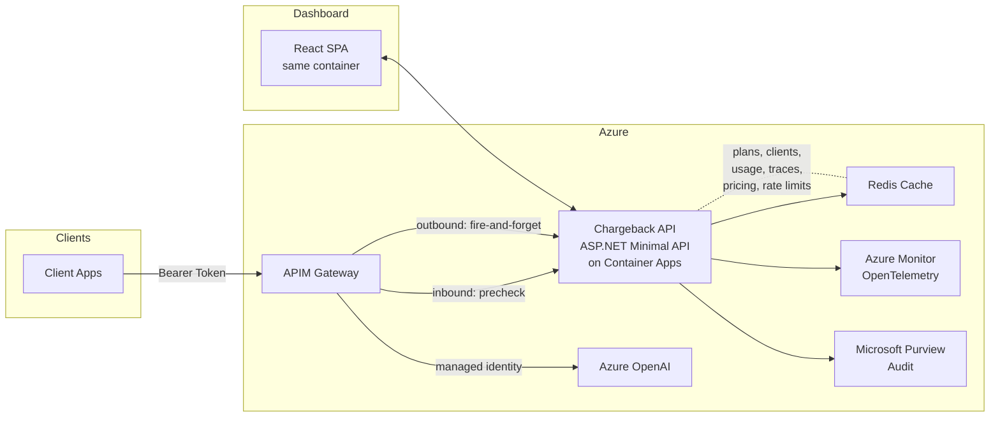

# Architecture Documentation

## System Overview

The Azure API Management OpenAI Chargeback Environment is a single **ASP.NET Minimal API** (.NET 10) running on **Azure Container Apps**, fronted by **Azure API Management** with **Entra ID JWT validation**. **Redis** provides all state storage (plans, clients, usage, traces, pricing, rate limits). A **React SPA dashboard** is served from the same container.

## Component Diagram



## Request Flow

1. **Client sends request** to APIM with a Bearer token (Entra ID JWT).
2. **APIM validates JWT** using the Entra OpenID Connect metadata endpoint.
3. **APIM extracts claims** — `tid` (tenant), `appid`/`azp` (client identity), `aud` (audience).
4. **APIM calls the precheck endpoint** (`/api/precheck`) — the Chargeback API checks the client's plan, quota, and rate limits against Redis.
5. **If precheck returns 401/429**, APIM returns the error to the client. The request is blocked before reaching OpenAI.
6. **If precheck returns 200**, APIM forwards the request to Azure OpenAI using its managed identity.
7. **Azure OpenAI responds** with the completion/chat result.
8. **APIM outbound policy** captures the response and sends a fire-and-forget POST to `/api/log`.
9. **`/api/log` records usage** — updates token quotas, tracks per-deployment usage, records a trace entry, and calculates customer cost for overbilled tokens.
10. **Client receives the OpenAI response** (unmodified).

## Data Model

All state is stored in Redis with the following key patterns:

| Entity | Redis Key Pattern | TTL | Description |
|--------|-------------------|-----|-------------|
| **Plans** | `plan:{id}` | None (persistent) | Billing configuration — monthly quota, rate limits, overbilling flag, cost rates |
| **Clients** | `client:{appId}` | None (persistent) | Plan assignment, usage tracking, tenant/app identity |
| **Usage Logs** | `{tenantId}-{clientAppId}-{deploymentId}` | 24 hours | Aggregated token counts (prompt + completion) per deployment |
| **Traces** | `traces:{clientAppId}` (list) | 7 days | Individual request records with timestamps, tokens, model, cost |
| **Pricing** | `pricing:{modelId}` | None (persistent) | Cost rates per model (input/output per million tokens) |
| **Rate Limits** | `ratelimit:rpm/tpm:{clientAppId}:{minuteBucket}` | 2 minutes | Sliding window counters for RPM and TPM enforcement |

## Security Architecture

- **Entra JWT validation at the APIM gateway** — the backend API does not perform JWT validation itself; APIM handles it via `validate-jwt` policy against the Entra OpenID Connect metadata.
- **Client credentials flow** (`appid` claim) — used for service-to-service authentication.
- **Delegated flow** (`azp` claim) — used for user-interactive/on-behalf-of authentication.
- **Managed identity** — APIM authenticates to Azure OpenAI using its system-assigned managed identity. No API keys are exchanged.
- **No subscription keys** — all APIM APIs have subscription requirements disabled. Authentication is exclusively via Entra ID JWT bearer tokens.

## Billing Architecture

- **Plans** define: monthly token quota, rate limits (TPM and RPM), an `allowOverbilling` flag, and `costPerMillionTokens` rate.
- **Per-deployment quotas** are supported via the `rollUpAllDeployments` toggle. When disabled, each OpenAI deployment has an independent quota.
- **Precheck (inbound)** gates requests *before* the OpenAI call — verifies the client has remaining quota and is within rate limits.
- **Log (outbound)** records actual token usage *after* the OpenAI response, fire-and-forget — does not block the client response.
- **Customer cost** is calculated only for overbilled tokens (tokens exceeding the plan's included quota when `allowOverbilling` is true).

## Observability

- **OpenTelemetry** via .NET Aspire `ServiceDefaults` — automatic instrumentation for HTTP, Redis, and custom spans.
- **Azure Monitor / Application Insights** — centralized logging and distributed tracing.
- **Custom metrics**:
  - `tokens_processed` — total tokens processed (prompt + completion)
  - `cost_total` — cumulative cost of overbilled tokens
  - `requests_processed` — total API requests handled
- **Microsoft Purview audit emission** (optional) — for organizations with M365 E5 licenses, audit events are emitted to Purview for compliance and DLP integration.

## Deployment Architecture

### Infrastructure as Code
All Azure resources are provisioned via **Bicep** modules located in `infra/` and `infra/`.

### Container Apps
- The Chargeback API and React SPA are packaged into a single container image.
- Azure Container Apps provides automatic scaling, ingress, and revision management.
- Health probes are configured for liveness and readiness checks.

### Multi-Region Support
Both Container Apps and APIM support multi-region deployment via the Bicep modules. Deploy additional regions by parameterizing the infrastructure templates.

### CI/CD
```
Source Control (Git)
↓
Build Pipeline
├── dotnet build / dotnet test
├── Container image build
└── Bicep validation (what-if)
↓
Deploy Pipeline
├── Infrastructure (Bicep)
├── Container image push → Container Apps
├── APIM policy deployment
└── Health check verification
```
